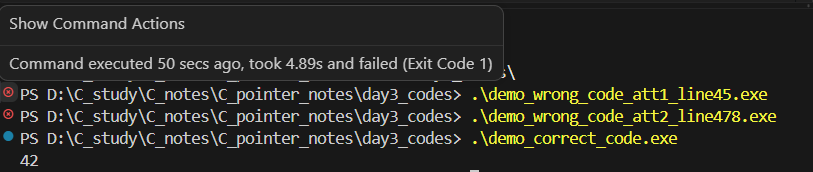

# Pointer notes - day 3

### 1. Phép lấy giá trị con trỏ - Indirect Operator
Kí hiệu phép lấy giá trị con trỏ: `*`

Mục đích: Phép này dùng để truy cập hoặc thực hiện liên quan đến giá trị tại địa chỉ mà con trỏ đang lưu

Vẫn là chương trình của hôm qua, nhưng ta sửa thành như sau:
```
#include <stdio.h>

int main()
{
    int i = 15, *p; //Khởi tạo biến i và biến con trỏ p
    p = &i; //Gán địa chỉ của biến i vào p
    printf("%x, %x, %x", *p, p, i);

    return 0;
}
```
Kết quả là những chuỗi hexa như sau:
```
Lần 1: f, 6940ea04, f
Lần 2: f, 9700d704, f
Lần 3: f, 63f42194, f
...
```

Ta có thể thấy: Ngoài những dãy số hexa ở giữa mà chúng ta đã nói ở buổi hôm qua thì ở cột đầu tiên, giá trị của *p không đổi và bằng giá trị của biến i. 

Khi đó, câu lệnh `printf("%x", *p);` in ra giá trị của biến i, không phải địa chỉ của i. 

Ngoài ra, khi viết lại chương trình trên như sau:
```
#include <stdio.h>

int main()
{
    int i = 15, *p; //Khởi tạo biến i và biến con trỏ p
    p = &i;
    i = 20;
    printf("%x, %x, %x", *p, p, i);

    return 0;
}
```
Kết quả:
```
14, f9a5f764, 14
```
Ta có thể thấy: Khi i thay đổi thì *p cũng sẽ thay đổi
#### Lưu ý
* Không nên cố gắng dùng phép lấy giá trị cho biến con trỏ chưa được khởi tạo giá trị.
Nếu biến con trỏ chưa có giá trị khởi tạo, việc sử dụng giá trị của p có thể gây ra các kết quả không mong muốn.
* Không nên gán giá trị vào `*p`. Nếu p có địa chỉ bộ nhớ hợp lệ, phép gán này sẽ cố gắng làm thay đổi dữ liệu bên trong địa chỉ đó. 
Nếu vùng nhớ bị thay đổi bởi phép gán này thuộc về chương trình, chương trình có thể hoạt động bất thường; nếu vùng nhớ đó thuộc về hệ điều hành, chương trình rất có thể sẽ bị crash.

Dưới đây là chương trình demo lưu ý ở trên:
```c {.line-numbers}
#include <stdio.h>

int main(void) {
    //int *p;
    //printf("%d", *p);   /*** WRONG ***/

    //*p = 1;
   //printf("%d", *p);   /*** WRONG ***/

    //Correct usage:
    int value = 42; 
    int *good_p = &value;
    printf("%d", *good_p);
    

    return 0;
}
```
Có 3 chương trình khác nhau được biên dịch từ đoạn code trên, trong đó:
* Chương trình đầu tiên được tạo từ các dòng số 4 và số 5.
* Chương trình thứ hai được tạo từ các dòng số 4,7 và 8.
* Chương trình thứ ba được tạo từ dòng số 10 đến hết.

Kết quả khi biên dịch và chạy chương trình như sau:

Kết quả cho thấy hai chương trình đầu không hoạt động, chương trình thứ 3 in đúng giá trị ra màn hình. Từ đó, ta có thể thấy được rằng không nên làm những điều trên vì chúng có thể làm cho chương trình không hoạt động.

### 2. Gán giá trị cho con trỏ
Ta có thể dùng phép gán để sao chép con trỏ cùng kiểu dữ liệu.

Giả sử ta có 4 biến i,j,p,q được khai báo như sau:
```
int i, j, *p, *q;
```
Câu lệnh `p = &i;` chính là một ví dụ của phép gán con trỏ. Khi đó địa chỉ của i sẽ được ghi/gán vào biến p.
Với câu lệnh `q = p;` nội dung của p(tức địa chỉ của i) sẽ được ghi/gán vào biến q. Khi đó cả q và p cùng trỏ vào biến i.

Xét đoạn chương trình sau:
```
#include <stdio.h>
int main(void) 
{
    int i, j, *p, *q;
    p = &i;
    q = p;

    *p = 1; //Gán giá trị cho p
    printf("%d, %d, %d\n", i, *p, *q);
    *q = 2; //Gán giá trị cho q
    printf("%d, %d, %d\n", i, *p, *q);
    //Thứ tự in: Giá trị của i, giá trị của biến con trỏ p và q

}
```
Kết quả:
```
1, 1, 1
2, 2, 2
```
Khi ta thay đổi giá trị của `*p` hoặc `*q` thì giá trị của i cũng thay đổi theo vì lúc này, cả p và q cùng trỏ tới i

#### Lưu ý
* Cần tránh nhầm lẫn giữa `q = p` với `*q = *p`. Cái đầu tiên là phép gán con trỏ, còn cái thứ hai thì không. Nó chỉ lấy giá trị của con trỏ p đang trỏ vào (giá trị của biến i) gán vào giá trị của con trỏ q đang trỏ vào (giá trị của biến j)
Chương trình sau sẽ chứng minh điều đó:
```
#include <stdio.h>
int main(void) 
{
    int i, j, *p, *q;
    p = &i;
    q = &j;

    i = 1;
    printf("%d, %d, %d, %d\n", i, j, *p, *q);
    *q = *p;
    printf("%d, %d, %d, %d\n", i, j, *p, *q);
}
```
Kết quả:
```
1, 0, 1, 0
1, 1, 1, 1
```
Kết quả cho thấy `*q = *p` và `j = i` tương đương nhau.