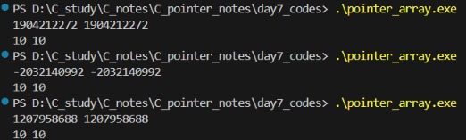
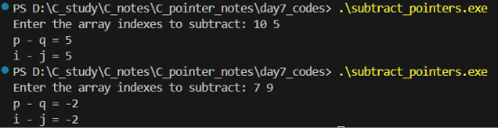
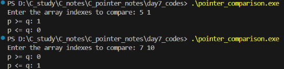

# Pointer notes - day 7
Những ngày qua, chúng ta đã tìm hiểu về khái niệm con trỏ và ứng dụng của con trỏ trong việc viết hàm. Từ hôm nay, chúng ta sẽ tìm hiểu một ứng dụng khác của con trỏ trong lập trình C. Đó là mối liên hệ giữa con trỏ và mảng(array).
### Các phép toán liên quan đến con trỏ và mảng
Chúng ta đã biết rằng con trỏ có thể trỏ tới các phần tử của mảng. Ta có thể xem chương trình sau:
```c
#include <stdio.h>
int main(void)
{
    int a[10], *p; // Declaring array and pointer
    p = &a[0]; // Assigning the address of the first element of the array to the pointer
    printf("%d %d\n", *p, a[0]); // Print the value before assignment
    *p = 10; // Assigning the value for *p
    printf("%d %d\n", *p, a[0]); // Print the value after assignment
    return 0;
}
```
Ở chương trình này, địa chỉ của a[0] được gán vào biến con trỏ p. Khi đó ta có thể truy cập a[0] thông qua p. Sau đó các câu lệnh `printf` in ra ngoài màn hình giá trị trước và sau khi gán giá trị cho a[0]. Kết quả như hình dưới:

Ta có thể thấy chương trình được chạy 3 lần. Trước khi gán, một giá trị ngẫu nhiên được in ra và sau khi gán, giá trị mới đã được in chính xác và không thay đổi. Khi đó ta có thể gán địa chỉ của phần tử khác của a cho p và thực hiện tương tự chương trình trên. Tuy nhiên, nếu bài toán yêu cầu truy cập nhiều phần tử khác cùng một lúc của mảng, ta có thể thực hiện các phép toán với con trỏ được trỏ đến mảng.
C chỉ hỗ trợ **3 phép toán với con trỏ** sau:
* Cộng 1 số nguyên vào một con trỏ
* Trừ 1 số nguyên ra khỏi một con trỏ
* Trừ con trỏ này khỏi con trỏ khác
Các mục con dưới đây giúp chúng ta tìm hiểu về các phép toán này. Để dễ diễn đạt, mảng a[n] và hai biến con trỏ p và q được khai báo trước và biến p trỏ tới phần tử a[i] của mảng ($0 \leq i < n $)
#### 1.1. Phép cộng 1 số nguyên vào con trỏ
Biết rằng `j` là một số nguyên. Khi đó phép cộng `p + j` sẽ trỏ tới phần tử `a[i+j]` trong mảng a (Nếu phần tử đó tồn tại)
Chương trình ví dụ dưới đây cho ta thấy được điều đó:
```c
#include <stdio.h>
int main(void)
{
    int a[15] = {1,2,3,4,5,6,8,10,14,22,30,60,120,250,500}, *p, *q; // Variable declaration

    p = &a[1]; // p -> a[1]. Then *p = 2
    printf("Initial value of p = %d\n",*p);

    q = p + 5; // q -> a[1+5] = a[6]. Then *q = 8
    printf("Value of q = %d\n",*q);

    p += 10; // p(new) -> a[1+10] = a[11]. Then *p(new) = 60
    printf("Value of p after addition = %d\n",*p);

    return 0;
}
```
Trong phần code comments, kí hiệu `p -> a[i]` nghĩa là p đang trỏ tới phần tử a[i]. Ở đây ta chọn $p \rightarrow a[1]$. Ta thực hiện phép cộng `p + 5` rồi lưu vào biến `q`. Khi đó $q \rightarrow a[1+5] = a[6]$. Tiếp theo ta thực hiện phép cộng `p + 10` rồi lưu vào `p`. Khi đó $p \rightarrow a[1+10] = a[11] $. Kết quả chương trình như sau:
```c                     
Initial value of p = 2 //a[1]
Value of q = 8 //a[6]
Value of p after addition = 60 //a[11]
```
Kết quả cho thấy phép cộng `p+j` luôn trỏ tới phần tử `a[i+j]`
Thực tế, phần comment trên không có khi chạy chương trình. Chúng chỉ giải thích thêm về việc hai biến con trỏ đang trỏ tới phần tử nào của mảng.
#### 1.2. Phép trừ 1 số nguyên ra khỏi con trỏ
Tương tự như trên, phép trừ `p - j` sẽ trỏ tới phần tử `[a-j]` trong mảng. 
Chương trình ví dụ: 
```c
#include <stdio.h>
int main(void)
{
    int a[15] = {1,2,3,4,5,6,8,10,14,22,30,60,120,250,500}, *p, *q; // Variable declaration

    p = &a[7]; // p -> a[7]. Then *p = 10
    printf("Initial value of p = %d\n",*p);

    q = p - 5; // q -> a[7-5] = a[2]. Then *q = 3
    printf("Value of q = %d\n",*q);

    p -= 6; // p(new) -> a[7-6] = a[1]. Then *p(new) = 2
    printf("Value of p after subtraction = %d\n",*p);

    return 0;
}
```
Ở chương trình này, đầu tiên ta gán $p \rightarrow a[7]$, rồi ta thực hiện phép trừ `p - 5` rồi lưu vào biến `q`. Khi đó $q \rightarrow a[7-5] = a[2]$. Tiếp theo ta thực hiện phép cộng `p + 10` rồi lưu vào `p`. Khi đó $p \rightarrow a[1+10] = a[11] $. Kết quả chương trình như sau:
```c
Initial value of p = 10 //a[7]
Value of q = 3 //a[2]
Value of p after subtraction = 2 //a[1]
```
Kết quả cho thấy phép trừ `p-j` luôn trỏ tới phần tử `a[i-j]`
Thực tế, phần comment trên không có khi chạy chương trình. Chúng chỉ giải thích thêm về việc hai biến con trỏ đang trỏ tới phần tử nào của mảng.
#### 1.3. Phép trừ hai con trỏ
Khi biến `p` trỏ tới phần tử `a[i]` của mảng và biến q trỏ tới phần tử `a[j]` thì phép tính `p - q` luôn có giá trị là  `i - j`.
Chương trình ví dụ:
```c
#include <stdio.h>
int main(void)
{
    int a[15] = {1,2,3,4,5,6,8,10,14,22,30,60,120,250,500}, *p, *q; // Variable declaration
    int i, j;
    printf("Enter the array indexes to subtract: ");
    scanf("%d %d",&i,&j);
    p = &a[i];
    q = &a[j];
    printf("p - q = %d\n", p - q);
    printf("i - j = %d\n", i - j);
    return 0;
}
```
Ở chương trình này, ta sẽ nhập từ bàn phím hai chỉ số i và j. Các phần tử có chỉ số được lựa chọn tương ứng được gán địa chỉ vào hai biến p và q. Chương trình sẽ in ra kết quả của hai phép tính `p-q` và `i-j`
Kết quả chạy như sau:

Kết quả cho ta thấy được hai phép tính trên có cùng kết quả, vì chúng đều là khoảng cách tương đối giữa hai phần tử của mảng.
#### 1.4: Phép so sánh giữa hai con trỏ 
Ta có thể dùng các phép toán quan hệ như sau để so sánh con trỏ:
* `<`
* `>`
* `<=`
* `>=`
* `==`
* `!=`
Kết quả của phép toán này phụ thuộc vào vị trí tương đối của hai phần tử của mảng.
Chương trình ví dụ:
```c
#include <stdio.h>
int main(void)
{ int a[15] = {1,2,3,4,5,6,8,10,14,22,30,60,120,250,500}, *p, *q; // Variable declaration
    int i, j;
    printf("Enter the array indexes to compare: ");
    scanf("%d %d",&i,&j);
    p = &a[i];
    q = &a[j];
    printf("p >= q: %d\n", p >= q);
    printf("p <= q: %d\n", p <= q);
}
```
Ở chương trình này, tương tự chương trình trên, hai chỉ số i và j vẫn được nhập bàn phím, chương trình trả về kết quả của hai phép so sánh giữa p và q.
Kết quả chạy chương trình:
 
Kết quả cho ta thấy khi $p \rightarrow a[5], q\rightarrow a[1]$ thì `p>=q` có kết quả là 1, còn khi $p \rightarrow a[7], q\rightarrow a[10]$ thì `p<=q` có kết quả là 1. Điều đó cho thấy hai con trỏ này so sánh dựa trên vị trí tương đối của hai phần tử trong mảng. Nói đơn giản, nếu i < j thì p < q và nếu i > j thì p > q.
#### Lưu ý
Các phép toán trên phải được thực hiện trong phạm vi cùng một mảng. Nếu không, lỗi không xác định có thể xảy ra.