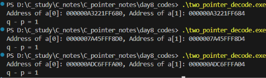

# Pointer notes - day 8
### 1. Bí ẩn đằng sau phép trừ hai con trỏ và phép so sánh hai con trỏ
Ngày hôm qua, chúng ta đã tìm hiểu về phép trừ hai con trỏ và phép so sánh hai con trỏ cùng trỏ tới hai phần tử trong một xâu. Chúng ta đã rút ra được kết luận rằng kết quả của hai phép toán trên liên quan đến vị trí tương đối của các phần tử có trong xâu. Vậy tại sao lại có mối liên hệ này? Chúng ta sẽ cùng tìm hiểu.
Xét một chương trình như sau:
```c
#include <stdio.h>
int main(void)
{
    int a[10]= {1,2,3,4,5,6,7,8,9,10};
    printf("Address of a[0]: %p, Address of a[1]: %p\n", (void*)&a[0], (void*)&a[1]);
    int *p, *q;
    p = &a[0];
    q = &a[1];
    printf("q - p = %ld\n", q - p);
    return 0;
}
``` 
Ở đây, chương trình in ra địa chỉ của `a[0]` và `a[1]` ở trong xâu đã cho. Ngoài ra nó in kết quả của phép tính `q-p` chúng ta đã nói đến ở hôm qua. 
Kết quả chạy chương trình như sau:

Ở đây, ta thấy địa chỉ của `a[0]` và `a[1]` luôn thay đổi mỗi khi chương trình được khởi chạy. Nhưng có điểm chung đó là nếu lấy địa chỉ của `a[1]` trừ cho `a[0]` ta được 4. Đó cũng là số lượng bytes mà 1 biến int sử dụng trong bộ nhớ. 
Điều này cho thấy hai phần tử liên tiếp trong mảng cách nhau một khoảng bằng kích thước của kiểu dữ liệu mà chúng có. Khi thực hiện phép trừ hai con trỏ, C sẽ không lấy trực tiếp hiệu của hai địa chỉ theo đơn vị byte, mà chuyển khoảng cách này về số lượng phần tử. Đó là bí ẩn đằng sau phép toán đối với con trỏ nói chung và 2 phép toán trên nói riêng
### 2. Sử dụng con trỏ trong xử lí xâu
Các phép toán liên quan đến con trỏ có thể giúp chúng ta truy cập từng phần tử của xâu bằng việc lặp lại phép toán cộng 1 đơn vị vào biến con trỏ.
Xét một chương trình tính tổng một xâu như sau:
```c
#include <stdio.h>
int sum(int a[], int n)
{
    int sum = 0;
    for(int *p = &a[0]; p < &a[n]; p++)
    {
        sum += *p;
    }
    return sum;
}
int main(void)
{
    int a[10]= {1,2,3,4,5,6,7,8,9,10};
    printf("Sum of array elements: %d\n", sum(a, 10));
    return 0;
}
```
Ở đây ta có thể thấy lạ ở phép toán `p < &a[n]`. Mặc dù `a[n]` không tồn tại, nhưng ta hoàn toàn sử dụng được phép lấy địa chỉ cho biến này. Sử dụng `a[n]` theo phong cách này là chắc chắn an toàn, vì vòng lặp không cố gắng kiểm tra giá trị này. Vòng lặp vẫn được thực thi khi `p = &a[i]`($0 \leq i < n$). Chỉ khi `p = &a[n]` thì vòng lặp kết thúc. 
Kết quả của chương trình như sau:
```
Sum of array elements: 55
```
Kết quả cho thấy chương trình đã tính đúng tổng của các số đã cho trong xâu. Khi đó ta có thể thấy được chương trình có thể thực hiện nhiệm vụ được giao, mặc dù có điểm kỳ lạ trong cú pháp.
Chúng ta có thể sử dụng chỉ số như bình thường, nhưng cách này có một điểm mạnh là giảm được thời gian biên dịch và thực thi. Tuy nhiên, nó phụ thuộc cách bạn viết thuật toán. Có một số trình biên dịch có thể biên dịch hiệu quả với cách viết chỉ số.