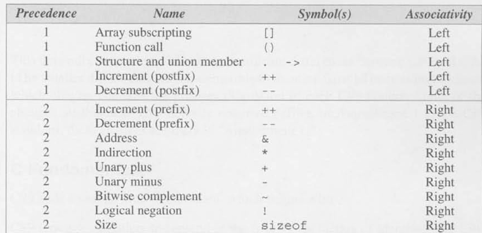

# Pointer notes - day 9
### 1. Kết hợp hai phép * và ++
Phép toán lấy giá trị `*` và phép `++` thường được kết hợp với nhau khi viết các câu lệnh xử lí xâu. 
Ví dụ khi gán một giá trị cho một phần tử của xâu, bình thường chúng ta có thể viết như sau:
```
a[i++] = j
```
Nếu biến con trỏ `p` đang trỏ tới phần tử `a[i]` của xâu, ta có thể viết câu trên như sau:
```
*p++ = j
```
Trong bảng thứ tự ưu tiên các phép toán chuẩn của C như hình dưới:

Ta có thể thấy phép `++` được ưu tiên thực hiện trước phép `*`. Khi đó trình biên dịch sẽ hiểu câu lệnh trên như sau:
```
*(p++) = j
```
Để ý rằng `++` được dùng dưới dạng postfix, tức là dạng hậu tố, là dạng phép toán mà biến sẽ được tăng lên giá trị mới sau khi giá trị cũ được sử dụng. Khi đó kết quả của `p++` là `p`, dẫn đến câu lệnh trên tương đương `*p` - Giá trị của biến mà `p` đang trỏ tới 
Ngoài cách viết đã nói ở trên, ta còn có thể kết hợp theo các cách sau:
|Cách viết|Ý nghĩa|
|-|-|
|`*p++` hoặc `*(p++)`|Giá trị của `*p` được sử dụng trước khi `p` tăng 1 đơn vị|
|`(*p)++`|Giá trị của `*p` được sử dụng trước khi `*p` - giá trị của biến mà `p` đang trỏ tới - tăng 1 đơn vị|
|`*++p` hoặc `*(++p)`|Giá trị của `*p` được sử dụng sau khi `p` tăng lên 1 đơn vị|
|`++*p` hoặc `++(*p)`|Giá trị của `*p` được sử dụng sau khi `*p` tăng lên 1 đơn vị|

Nếu ai đó hỏi có thể kết hợp phép `*` và phép `--` được không, thì câu trả lời là có, vì `++` và `--` có cùng mức ưu tiên, không quan trọng việc bạn dùng nó ở dạng prefix hay postfix.
